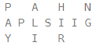
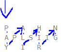
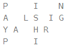

# p_6_zigzag_conversion

🔗 https://leetcode.com/problems/zigzag-conversion/description/?source=submission-noac

## Leetcode - 6 - Zigzag conversion

The string "PAYPALISHIRING" is written in a zigzag pattern on a given number of rows like this: (you may want to display this pattern in a fixed font for better legibility)

  

And then read line by line: "PAHNAPLSIIGYIR"  

Write the code that will take a string and make this conversion given a number of rows:

string convert(string s, int numRows);
 

Example 1:

Input: s = "PAYPALISHIRING", numRows = 3
Output: "PAHNAPLSIIGYIR"

Example 2:

Input: s = "PAYPALISHIRING", numRows = 4
Output: "PINALSIGYAHRPI"
Explanation:

Example 3:

Input: s = "A", numRows = 1
Output: "A"
 

Constraints:

1 <= s.length <= 1000  
s consists of English letters (lower-case and upper-case), ',' and '.'.  
1 <= numRows <= 1000  
